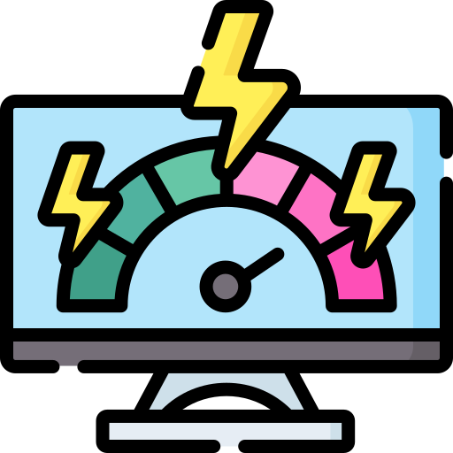
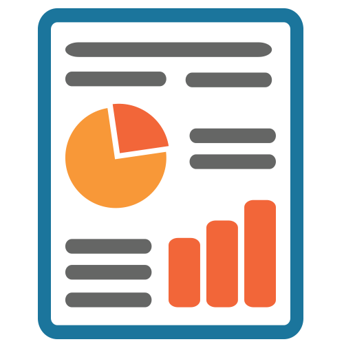
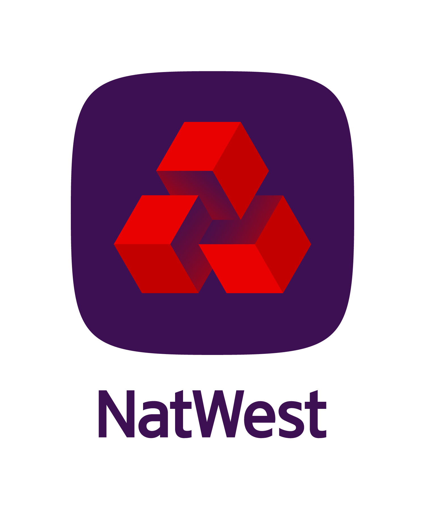

<!-- Main -->

<!-- Hero Section -->
<section id="hero" class="hero-section">
    

        

            <h1 class="hero-title">
                Professional
                Background
            </h1>
            

                Education, Experience & Skills
            

        

        

            

                

                

                    

                        

                            
7+

                            
Years Experience

                        

                        

                            
5

                            
Major Roles

                        

                        

                            
Risk

                            
Specialist

                        

                    

                

            

        

    

    

        

    

</section>

<!-- Key Competencies -->
<section id="competencies" class="competencies-section">
    

        <h2 class="section-title">Key Competencies</h2>
        

            

                

                    
                

                <h3 class="competency-title">Economic Analysis & Stress Testing</h3>
                
Macroeconomics, Risk Analsyis, Scenario Analysis, Basel, IFRS9, and Financial Indicators

            

            
            

                

                    
                

                <h3 class="competency-title">Programming & Scripting</h3>
                
Analysis, Research, Logic, Scientific Method, Creativity, and a Variety of Languages

            

            
            

                

                    
                

                <h3 class="competency-title">Data Analytics & Data Mining</h3>
                
Databases, Extracts, Reporting, and Predictive Analysis

            

            
            

                

                    
                

                <h3 class="competency-title">Documentation, Presenting & Report Writing</h3>
                
Audience Analysis, Attention to Deail and Tracing, Evidencing Mindset

            

        

    

</section>

<!-- Summary of Experience -->
<section id="experience-summary" class="experience-summary-section">
    

        <h2 class="section-title">Summary of Experience</h2>
        

            
I am a skilled Quantitative Risk Analyst/Data Scientist. With a degree in Materials Science and Engineering, I have several years of experience in developing quantitative methods to forecast credit impairments and risk-weighted assets, reviewing stress testing results, presenting to senior management, and creating automated reporting dashboards. My expertise lies in Python, advanced Excel, and SQL, as well as a good understanding of the regulatory landscape with regards to IFRS9 and the Basel accords. Here is summary of my key roles:

            
            

                

                    <h3 class="role-title">Lead Quantitative Risk Model Developer</h3>
                    
In my role in Credit Forecasting at JP Morgan, I support the expansion of the ICB business expansion across the UK and Europe. My responsibilities included forecasting credit losses and allowance, developing analytics for new products, and collaborating with various stakeholders. I leveraged my strong analytical skills and coding expertise in Python to drive data-driven decision-making and the developement of loss forecasting models.

                

                
                

                    <h3 class="role-title">Quantitative Stress Testing Analyst</h3>
                    
As a Quantitative Stress Testing Analyst at NatWest Group, I conducted and analysed regulatory and internal stress tests, covering IFRS9, Basel Pillar II, and III requirements. analysis using Python, advanced Excel, and SQL. I co-lead the development and implementation of Probability of Default models, as well as leading the development of an purpose built Mortgage Arrears prediction model. My focus was to identify key drivers of the stress results and communicate business implications for NatWest Group's retail lending products under both business-as-usual conditions and adverse economic stresses.

                

                
                

                    <h3 class="role-title">Graduate Data Scientist</h3>
                    
During my time as a Graduate Technology Analyst at NatWest Group, I gained valuable experience in data science, product analytics, and security and fraud analysis. Working closely with senior scientists, I leveraged various Python libraries and utilized tools like SAS, SQL, and Tableau for effective data visualization. I also contributed to fraud prevention efforts by researching and writing educational papers.

                

            

        

    

</section>

<!-- Resume Section -->
<section id="resume" class="resume-section">
    

        <h2 class="section-title">Resume</h2>
        
        <!-- Education -->
        

            <h3 class="subsection-title">Education</h3>
            

                

                    
                

                

                    <h4 class="education-institution">University of Manchester</h4>
                    
Materials Science & Engineering, 2017 Graduation Courses & Achievments: Superalloys & High Performance Materials, Advanced Metals Processing, Metallurgy of Engineering Alloys, Advanced Nuclear Materials, Composite & Advanced Materials. Written a first-class thesis on metal oxide thermoelectrics

                

            

        

        <!-- Work Experience -->
        

            <h3 class="subsection-title">Work Experience</h3>
            

                
                <!-- JP Morgan -->
                

                    

                        

                            

                                
                            

                            

                                <h4 class="position-title">JP Morgan | Lead Risk Model Developer</h4>
                                
London, UK September 2024 – Current

                            

                        

                    

                    

                        <ul class="experience-responsibilities">
                            <li>Leading the development and implementation of credit risk loss forecasting models for JP Morgan's ICB business.</li>
                            <li>Collaborating with cross-functional teams to ensure compliance with regulatory requirements and internal risk management frameworks.</li>
                            <li>Utilizing advanced analytics and machine learning techniques to enhance the accuracy and predictive power of credit risk assessments.</li>
                        </ul>
                    

                

                <!-- NatWest Lead Analyst -->
                

                    

                        

                            

                                
                            

                            

                                <h4 class="position-title">Natwest Holdings | Lead Personal & Business Banking UK Credit Stress Testing Analyst</h4>
                                
London, UK December 2022 – August 2024

                            

                        

                    

                    

                        <ul class="experience-responsibilities">
                            <li>Provided review and challenge of stress testing results including portfolio deep dive and benchmarking analysis, using advanced Python, advanced Excel, and SQL for the Retail franchise arms of NatWest Group.</li>
                            <li>Presented credit risk stress testing results to senior management and business stakeholders, focusing on key drivers of results and business implications.</li>
                            <li>Coverage included: Banking book models, PD, LGD, EAD models, and ICAAP, EBA, and PRA stress tests.</li>
                        </ul>
                    

                

                <!-- NatWest Markets -->
                

                    

                        

                            

                                
                            

                            

                                <h4 class="position-title">NatWest Holdings | NatWest Markets Credit Stress Testing Analyst</h4>
                                
London, UK September 2019 – November 2022

                            

                        

                    

                    

                        <ul class="experience-responsibilities">
                            <li>Developed automated methods in Python to validate both retail and wholesale credit stress testing models as well as executed top-down credit risk stress testing results.</li>
                            <li>Delivered support for projects, data, and security for systems and controls related to the information security department.</li>
                            <li>Created automated reporting dashboards to be used by multiple users for analysing, understanding, and reporting stress test outcomes, using Python, Excel, and Tableau.</li>
                        </ul>
                    

                

                <!-- Data Scientist -->
                

                    

                        

                            

                                
                            

                            

                                <h4 class="position-title">NatWest Holdings | Data Scientist</h4>
                                
London, UK September 2018 – September 2019

                            

                        

                    

                    

                        <ul class="experience-responsibilities">
                            <li>Assisted with the delivery of experiments and worked with senior scientists and data engineers in building functional machine learning models.</li>
                            <li>Gained experience working with various Python libraries, including pandas, numpy, and scikit-learn.</li>
                        </ul>
                    

                

                <!-- Coutts -->
                

                    

                        

                            

                                
                            

                            

                                <h4 class="position-title">NatWest Holdings | Coutts | Product Analytics</h4>
                                
London, UK September 2017 – September 2018

                            

                        

                    

                    

                        <ul class="experience-responsibilities">
                            <li>Engaged with stakeholders within the private bank and utilised coding and data visualisation programs (SAS, SQL, and Tableau) to achieve business deliverables.</li>
                            <li>Main projects included customer segmentation analysis, competitor analysis, as well as performing ad-hoc data queries for various teams in the private bank.</li>
                        </ul>
                    

                

            

        

        <!-- Projects -->
        

            <h3 class="subsection-title">Projects</h3>
            

                

                    

                        
                    

                    

                        <h4 class="project-title-resume">Pitch IQ: Educational Sports Analytics Site</h4>
                        <ul class="project-details-resume">
                            <li>Sports Analytics & Blogging</li>
                            <li>A personal and insightful football analytics platform I created as a hobbyist football data scientist.</li>
                        </ul>
                        <a href='https://steveaq.github.io/' class="project-button">View Project</a>
                    

                

                

                    

                        
                    

                    

                        <h4 class="project-title-resume">Cannon IQ: An Arsenal Specific Data Blog</h4>
                        <ul class="project-details-resume">
                            <li>Sports Blogging</li>
                            <li>I also created Cannon IQ, a dedicated substack blog focusing exclusively on my beloved Arsenal. As a die-hard Gunners fan, I delve into the tactics, player analysis, and financial dynamics specific to Arsenal.</li>
                        </ul>
                        <a href='https://cannoniq.substack.com/' class="project-button">View Project</a>
                    

                

                

                    

                        
                    

                    

                        <h4 class="project-title-resume">Spotify Recommendation Algorithm</h4>
                        <ul class="project-details-resume">
                            <li>Personal Project</li>
                            <li>A documented project going through how to work with and create a recomendation algorithm with spotify's python API.</li>
                        </ul>
                        <a href="https://github.com/steveaq/spotify_project" class="project-button">View Project</a>
                    

                

                

                    

                        
                    

                    

                        <h4 class="project-title-resume">Machine Learning Prediction Model Project</h4>
                        <ul class="project-details-resume">
                            <li>Predictive Analytics</li>
                            <li>Leveraging historical FIFA rankings and international match results, the model aims to accurately forecast the tournament's final match and the eventual winner.</li>
                        </ul>
                        <a href='https://github.com/steveaq/ML-2024-Euros-Model/tree/main' class="project-button">View Project</a>
                    

                

            

        

    

</section>

<!-- Skills Section -->
<section id="skills" class="skills-section">
    

        <h2 class="section-title">Skills</h2>
        

            

                

                    

                        <i class="material-icons">code</i>
                    

                    <h3 class="skills-category-title">Languages</h3>
                

                <ul class="skills-list">
                    <li>Python</li>
                    <li>SQL</li>
                    <li>SAS</li>
                    <li>R</li>
                    <li>Javascript</li>
                    <li>HTML/CSS</li>
                </ul>
            

            

                

                    

                        <i class="material-icons">dashboard</i>
                    

                    <h3 class="skills-category-title">Technologies</h3>
                

                <ul class="skills-list">
                    <li>Tableau</li>
                    <li>Power BI</li>
                    <li>AWS Athena</li>
                    <li>Git</li>
                    <li>MS Office</li>
                    <li>VS Code</li>
                </ul>
            

            

                

                    

                        <i class="material-icons">merge_type</i>
                    

                    <h3 class="skills-category-title">Soft Skills/Concepts</h3>
                

                <ul class="skills-list">
                    <li>Agile</li>
                    <li>Presenting</li>
                    <li>Report Writing</li>
                    <li>Documentation</li>
                    <li>Stakeholder Management</li>
                    <li>Communication</li>
                </ul>
            

            
            

                

                    

                        <i class="material-icons">analytics</i>
                    

                    <h3 class="skills-category-title">Analytics</h3>
                

                <ul class="skills-list">
                    <li>Data Analysis</li>
                    <li>Statistical Modeling</li>
                    <li>Risk Assessment</li>
                    <li>Machine Learning</li>
                    <li>Financial Modeling</li>
                    <li>Forecasting</li>
                </ul>
            

        

    

</section>

<style>
/* Reset and Base Styles */
* {
    margin: 0;
    padding: 0;
    box-sizing: border-box;
}

body {
    font-family: 'Inter', -apple-system, BlinkMacSystemFont, sans-serif;
    line-height: 1.6;
    color: #2d3748;
}

/* Hero Section */
.hero-section {
    min-height: 100vh;
    background: linear-gradient(135deg, #667eea 0%, #764ba2 100%);
    position: relative;
    display: flex;
    align-items: center;
    overflow: hidden;
}

.hero-section::before {
    content: '';
    position: absolute;
    top: 0;
    left: 0;
    right: 0;
    bottom: 0;
    background: 
        radial-gradient(circle at 20% 80%, rgba(120, 119, 198, 0.3) 0%, transparent 50%),
        radial-gradient(circle at 80% 20%, rgba(255, 119, 198, 0.3) 0%, transparent 50%);
    pointer-events: none;
}

.hero-content {
    max-width: 1200px;
    margin: 0 auto;
    padding: 0 2rem;
    display: grid;
    grid-template-columns: 1fr 400px;
    gap: 4rem;
    align-items: center;
    position: relative;
    z-index: 2;
}

.hero-title {
    font-size: clamp(3rem, 8vw, 6rem);
    font-weight: 900;
    line-height: 0.9;
    margin-bottom: 1.5rem;
}

.gradient-text {
    background: linear-gradient(135deg, #ffffff 0%, #f0f0f0 100%);
    -webkit-background-clip: text;
    -webkit-text-fill-color: transparent;
    background-clip: text;
}

.highlight-text {
    color: #ffd700;
    position: relative;
}

.highlight-text::after {
    content: '';
    position: absolute;
    bottom: 0;
    left: 0;
    width: 100%;
    height: 8px;
    background: rgba(255, 215, 0, 0.3);
    transform: skew(-12deg);
}

.hero-subtitle {
    font-size: 1.5rem;
    color: rgba(255, 255, 255, 0.9);
    margin-bottom: 2rem;
    font-weight: 600;
}

.accent-text {
    color: #ffd700;
    font-weight: 700;
}

.floating-card {
    position: relative;
    background: rgba(255, 255, 255, 0.1);
    backdrop-filter: blur(20px);
    border-radius: 20px;
    padding: 2rem;
    border: 1px solid rgba(255, 255, 255, 0.2);
    animation: float 6s ease-in-out infinite;
}

.card-glow {
    position: absolute;
    top: -2px;
    left: -2px;
    right: -2px;
    bottom: -2px;
    background: linear-gradient(45deg, #ffd700, #ff6b6b, #4ecdc4, #45b7d1);
    border-radius: 22px;
    opacity: 0;
    animation: glow 3s ease-in-out infinite alternate;
    z-index: -1;
}

.stats-grid {
    display: grid;
    grid-template-columns: repeat(3, 1fr);
    gap: 1.5rem;
}

.stat-item {
    text-align: center;
}

.stat-number {
    font-size: 2rem;
    font-weight: 900;
    color: #ffd700;
    margin-bottom: 0.5rem;
}

.stat-label {
    font-size: 0.9rem;
    color: rgba(255, 255, 255, 0.8);
    font-weight: 500;
}

.scroll-indicator {
    position: absolute;
    bottom: 2rem;
    left: 50%;
    transform: translateX(-50%);
    color: rgba(255, 255, 255, 0.7);
}

.scroll-arrow {
    width: 2px;
    height: 40px;
    background: rgba(255, 255, 255, 0.5);
    margin: 0 auto;
    position: relative;
    animation: scroll 2s ease-in-out infinite;
}

.scroll-arrow::after {
    content: '';
    position: absolute;
    bottom: 0;
    left: -4px;
    width: 0;
    height: 0;
    border-left: 5px solid transparent;
    border-right: 5px solid transparent;
    border-top: 8px solid rgba(255, 255, 255, 0.7);
}

/* Section Container */
.section-container {
    max-width: 1200px;
    margin: 0 auto;
    padding: 0 2rem;
}

.section-title {
    font-size: 3rem;
    font-weight: 900;
    text-align: center;
    margin-bottom: 4rem;
    background: linear-gradient(135deg, #667eea 0%, #764ba2 100%);
    -webkit-background-clip: text;
    -webkit-text-fill-color: transparent;
    background-clip: text;
}

/* Competencies Section */
.competencies-section {
    padding: 6rem 0;
    background: #f8fafc;
}

.competencies-grid {
    display: grid;
    grid-template-columns: repeat(4, 1fr);
    gap: 2rem;
}

.competency-card {
    background: white;
    padding: 2.5rem;
    border-radius: 20px;
    text-align: center;
    box-shadow: 0 10px 25px -5px rgba(0, 0, 0, 0.1);
    transition: all 0.3s cubic-bezier(0.4, 0, 0.2, 1);
}

.competency-card:hover {
    transform: translateY(-8px);
    box-shadow: 0 25px 50px -12px rgba(0, 0, 0, 0.25);
}

.competency-icon {
    width: 80px;
    height: 80px;
    margin: 0 auto 1.5rem;
    background: linear-gradient(135deg, #667eea, #764ba2);
    border-radius: 20px;
    display: flex;
    align-items: center;
    justify-content: center;
    padding: 1rem;
}

.competency-icon img {
    width: 100%;
    height: 100%;
    object-fit: contain;
    filter: brightness(0) invert(1);
}

.competency-title {
    font-size: 1.3rem;
    font-weight: 700;
    color: #1a202c;
    margin-bottom: 1rem;
}

.competency-description {
    color: #4a5568;
    line-height: 1.6;
}

/* Experience Summary Section */
.experience-summary-section {
    padding: 6rem 0;
    background: white;
}

.summary-intro {
    font-size: 1.1rem;
    color: #4a5568;
    line-height: 1.8;
    margin-bottom: 3rem;
    text-align: center;
    max-width: 900px;
    margin-left: auto;
    margin-right: auto;
}

.roles-grid {
    display: grid;
    grid-template-columns: repeat(auto-fit, minmax(350px, 1fr));
    gap: 2rem;
}

.role-card {
    background: #f8fafc;
    padding: 2.5rem;
    border-radius: 16px;
    border-left: 4px solid #667eea;
    transition: all 0.3s ease;
}

.role-card:hover {
    transform: translateY(-4px);
    box-shadow: 0 10px 25px -5px rgba(0, 0, 0, 0.1);
}

.role-title {
    font-size: 1.4rem;
    font-weight: 700;
    color: #1a202c;
    margin-bottom: 1rem;
}

.role-description {
    color: #4a5568;
    line-height: 1.7;
}

/* Resume Section */
.resume-section {
    padding: 6rem 0;
    background: #f8fafc;
}

.resume-subsection {
    margin-bottom: 4rem;
}

.subsection-title {
    font-size: 2rem;
    font-weight: 700;
    color: #1a202c;
    margin-bottom: 2rem;
    border-bottom: 3px solid #667eea;
    padding-bottom: 0.5rem;
}

/* Education */
.education-card {
    display: flex;
    gap: 2rem;
    background: white;
    padding: 2rem;
    border-radius: 16px;
    box-shadow: 0 4px 12px rgba(0, 0, 0, 0.1);
    align-items: center;
}

.education-logo {
    width: 100px;
    height: 100px;
    flex-shrink: 0;
}

.education-logo img {
    width: 100%;
    height: 100%;
    object-fit: contain;
}

.education-institution {
    font-size: 1.5rem;
    font-weight: 700;
    color: #1a202c;
    margin-bottom: 0.5rem;
}

.education-details {
    color: #4a5568;
    line-height: 1.6;
}

/* Work Experience */
.work-experience-container {
    display: flex;
    flex-direction: column;
    gap: 2rem;
}

.experience-item {
    background: white;
    border-radius: 16px;
    overflow: hidden;
    box-shadow: 0 4px 12px rgba(0, 0, 0, 0.1);
    transition: all 0.3s ease;
}

.experience-item:hover {
    transform: translateY(-4px);
    box-shadow: 0 12px 28px rgba(0, 0, 0, 0.15);
}

.experience-header {
    background: linear-gradient(135deg, #667eea, #764ba2);
    padding: 1.5rem 2rem;
    color: white;
}

.company-info {
    display: flex;
    align-items: center;
    gap: 1rem;
}

.company-logo {
    width: 60px;
    height: 60px;
    flex-shrink: 0;
    margin-left: -10px;
}

.company-logo img {
    width: 100%;
    height: 100%;
    object-fit: contain;
}

.position-title {
    font-size: 1.2rem;
    font-weight: 700;
    margin-bottom: 0.5rem;
}

.position-location {
    opacity: 0.9;
    font-size: 0.9rem;
}

.experience-content {
    padding: 2rem;
}

.experience-responsibilities {
    list-style: none;
    padding: 0;
}

.experience-responsibilities li {
    color: #4a5568;
    line-height: 1.7;
    margin-bottom: 1rem;
    position: relative;
    padding-left: 1.5rem;
}

.experience-responsibilities li::before {
    content: '•';
    color: #667eea;
    font-weight: bold;
    position: absolute;
    left: 0;
}

/* Projects Resume */
.projects-grid-resume {
    display: grid;
    grid-template-columns: repeat(4, 1fr);
    gap: 2rem;
}

.project-card-resume {
    background: white;
    padding: 2.5rem;
    border-radius: 20px;
    text-align: center;
    box-shadow: 0 10px 25px -5px rgba(0, 0, 0, 0.1);
    transition: all 0.3s cubic-bezier(0.4, 0, 0.2, 1);
    display: flex;
    flex-direction: column;
}

.project-card-resume:hover {
    transform: translateY(-8px);
    box-shadow: 0 25px 50px -12px rgba(0, 0, 0, 0.25);
}

.project-image-resume {
    width: 80px;
    height: 80px;
    margin: 0 auto 1.5rem;
    background: linear-gradient(135deg, #667eea, #764ba2);
    border-radius: 20px;
    display: flex;
    align-items: center;
    justify-content: center;
    padding: 1rem;
}

.project-image-resume img {
    width: 100%;
    height: 100%;
    object-fit: contain;
    filter: brightness(0) invert(1);
}

.project-content-resume {
    flex: 1;
    display: flex;
    flex-direction: column;
}

.project-title-resume {
    font-size: 1.3rem;
    font-weight: 700;
    color: #1a202c;
    margin-bottom: 1rem;
    line-height: 1.3;
}

.project-details-resume {
    list-style: none;
    padding: 0;
    margin-bottom: 2rem;
    flex: 1;
    text-align: left;
}

.project-details-resume li {
    color: #4a5568;
    font-size: 0.95rem;
    line-height: 1.6;
    margin-bottom: 0.8rem;
}

.project-button {
    display: inline-block;
    background: linear-gradient(135deg, #667eea, #764ba2);
    color: white;
    padding: 1rem 2rem;
    border-radius: 12px;
    text-decoration: none;
    font-weight: 600;
    font-size: 0.9rem;
    text-align: center;
    transition: all 0.3s ease;
    margin-top: auto;
}

.project-button:hover {
    transform: translateY(-2px);
    box-shadow: 0 10px 25px -5px rgba(102, 126, 234, 0.4);
}

/* Skills Section */
.skills-section {
    padding: 6rem 0;
    background: white;
}

.skills-categories {
    display: grid;
    grid-template-columns: repeat(4, 1fr);
    gap: 2rem;
}

.skills-category {
    background: white;
    padding: 2.5rem;
    border-radius: 20px;
    text-align: center;
    box-shadow: 0 10px 25px -5px rgba(0, 0, 0, 0.1);
    transition: all 0.3s cubic-bezier(0.4, 0, 0.2, 1);
}

.skills-category:hover {
    transform: translateY(-8px);
    box-shadow: 0 25px 50px -12px rgba(0, 0, 0, 0.25);
}

.skills-header {
    display: flex;
    flex-direction: column;
    align-items: center;
    margin-bottom: 2rem;
}

.skills-icon {
    width: 80px;
    height: 80px;
    background: linear-gradient(135deg, #667eea, #764ba2);
    border-radius: 20px;
    display: flex;
    align-items: center;
    justify-content: center;
    margin-bottom: 1.5rem;
}

.skills-icon i {
    font-size: 2.5rem;
    color: white;
}

.skills-category-title {
    font-size: 1.3rem;
    font-weight: 700;
    color: #1a202c;
    margin: 0;
}

.skills-list {
    list-style: none;
    padding: 0;
    margin: 0;
    display: grid;
    grid-template-columns: repeat(3, 1fr);
    gap: 1rem;
}

.skills-list li {
    background: #f8fafc;
    padding: 1rem;
    border-radius: 12px;
    color: #4a5568;
    font-weight: 500;
    font-size: 0.9rem;
    text-align: center;
    border: 1px solid #e2e8f0;
    transition: all 0.3s ease;
}

.skills-list li:hover {
    background: white;
    transform: translateY(-2px);
    box-shadow: 0 4px 12px rgba(0, 0, 0, 0.1);
}

/* Animations */
@keyframes float {
    0%, 100% { transform: translateY(0px); }
    50% { transform: translateY(-10px); }
}

@keyframes glow {
    0% { opacity: 0; }
    100% { opacity: 0.3; }
}

@keyframes scroll {
    0%, 100% { opacity: 1; }
    50% { opacity: 0.3; }
}

/* Responsive Design */
@media (max-width: 1024px) {
    .hero-content {
        grid-template-columns: 1fr;
        gap: 3rem;
        text-align: center;
    }
    
    .competencies-grid {
        grid-template-columns: repeat(2, 1fr);
    }
    
    .skills-categories {
        grid-template-columns: repeat(2, 1fr);
    }
    
    .skills-list {
        grid-template-columns: repeat(2, 1fr);
    }
    
    .projects-grid-resume {
        grid-template-columns: repeat(2, 1fr);
    }
}

@media (max-width: 768px) {
    .competencies-grid {
        grid-template-columns: 1fr;
    }
    
    .roles-grid {
        grid-template-columns: 1fr;
    }
    
    .skills-categories {
        grid-template-columns: 1fr;
    }
    
    .skills-list {
        grid-template-columns: repeat(2, 1fr);
        gap: 0.8rem;
    }
    
    .skills-list li {
        font-size: 0.8rem;
        padding: 0.8rem;
    }
    
    .projects-grid-resume {
        grid-template-columns: 1fr;
    }
    
    .education-card {
        flex-direction: column;
        text-align: center;
    }
}

@media (max-width: 480px) {
    .hero-title {
        font-size: 2.5rem;
    }
    
    .hero-subtitle {
        font-size: 1.2rem;
    }
    
    .stats-grid {
        grid-template-columns: 1fr;
        gap: 1rem;
    }
    
    .section-container {
        padding: 0 1rem;
    }
}